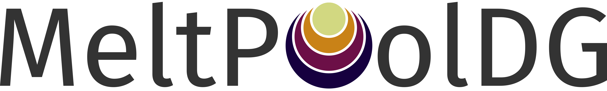

 
 

**MeltPoolDG** is an open-source, research-driven simulation software for **high-fidelity metal additive manufacturing**. It predicts the coupled **powder–melt–gas dynamics** occurring in processes such as **laser powder bed fusion (LPBF)** and **binder jetting**, aiming for the detailed simulations of melting, solidification, evaporation, recoil pressure, capillary effects, powder transport, and multiphase thermo-fluid–structure-contact interactions.

MeltPoolDG is developed as part of the [Professorship of Simulation for Additive Manufacturing (SAM)](https://www.epc.ed.tum.de/sam/home/) at the Technical University of Munich (TUM), with a focus on application-oriented, cutting edge simulation methods for metal additive manufacturing.

### Key Features

* High-fidelity multiphase thermo-fluid simulations for metal additive manufacturing
* Continuous and discontinuous Galerkin finite element methods (CG/DG FEM)
* Conservative level-set methods with CutFEM immersed-interface techniques
* Discrete element methods (DEM) for powder particle dynamics
* Matrix-free operator evaluation with SIMD vectorization
* Distributed-memory parallelization using MPI
* Adaptive mesh refinement
* Designed for application-oriented research and large-scale HPC simulations

> **Acknowledgement**
> MeltPoolDG builds upon the outstanding scientific computing ecosystem provided by [**deal.II**](dealii.org) and its third-party libraries. This project would not exist without the dedication of the deal.II developers and contributors.

## Documentation

📖 **User documentation and tutorials**

https://meltpooldg.github.io/MeltPoolDG/

📚 **Developer (Doxygen) documentation**

https://meltpooldg.github.io/MeltPoolDG/doxygen

## Installation

Installation instructions are available at

https://meltpooldg.github.io/MeltPoolDG/installation.html

## Contributing

If you're interested in contributing to MeltPoolDG, we welcome your collaboration.
Please follow [our contributing guidelines](https://github.com/MeltPoolDG/MeltPoolDG-dev/blob/main/CONTRIBUTING.md)
and [Code of Conduct](https://github.com/MeltPoolDG/MeltPoolDG-dev/blob/main/CODE_OF_CONDUCT.md).

If you need help with MeltPoolDG, feel free to ask questions, either via a discussion on GitHub or write directly to magdalena.schreter@tum.de.

## License

see the [LICENSE](https://github.com/MeltPoolDG/MeltPoolDG-dev/blob/main/LICENSE.md) file.
