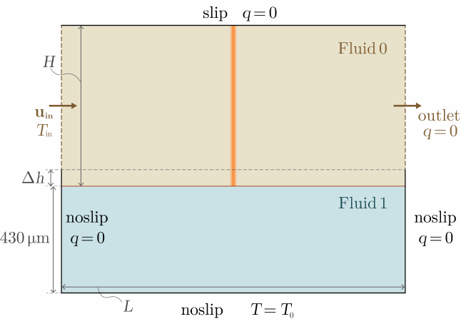

# Laser Melting by Simonds et al.

The cases discussed here are part of the collaboration with Bruno Blais
and Hélène Papillon-Laroche from Polytechnique Montréal on developing a
numerical benchmark for melt pool models. The material parameters should
represent Ti-6Al-4V and are derived from a thorough literature survey

<video width="800" controls>
  <source src="./doc/animation.mp4" type="video/mp4">
</video>

## Feature

- `mp-melt-pool` with inclined laser beam direction

## Folder Structure

TODO

## Problem Description

### Initial conditions

The initial configuration of the problem is given by the figure 1.

<figure align="center">
  
</figure>

**Figure 1**. Initial state of the problem.

TODO

### Boundary conditions

TODO

### Material parameters

TODO

### Specialties for 1D and 2D

- laser power for 1D:
- laser power for 2D: effective absorptivity = 0.35 * sqrt(2/pi)

##  Studied cases

TODO

## Simulation Results

TODO
