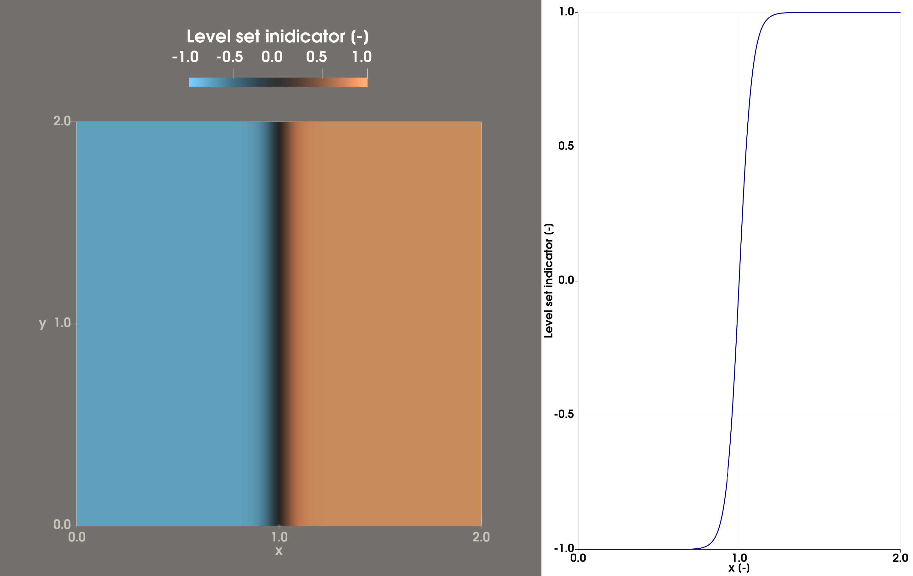
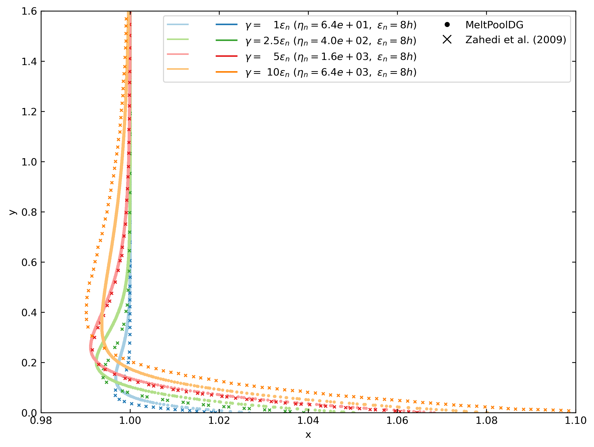
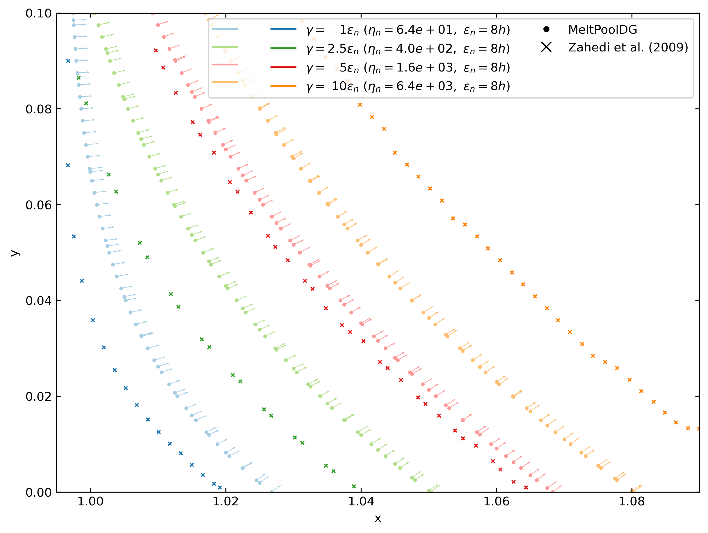
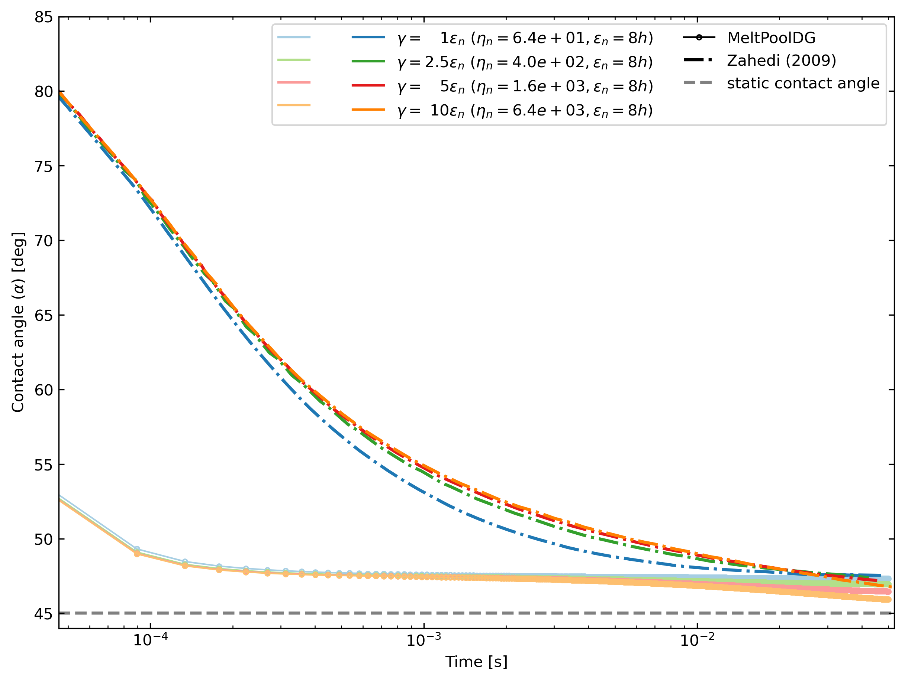
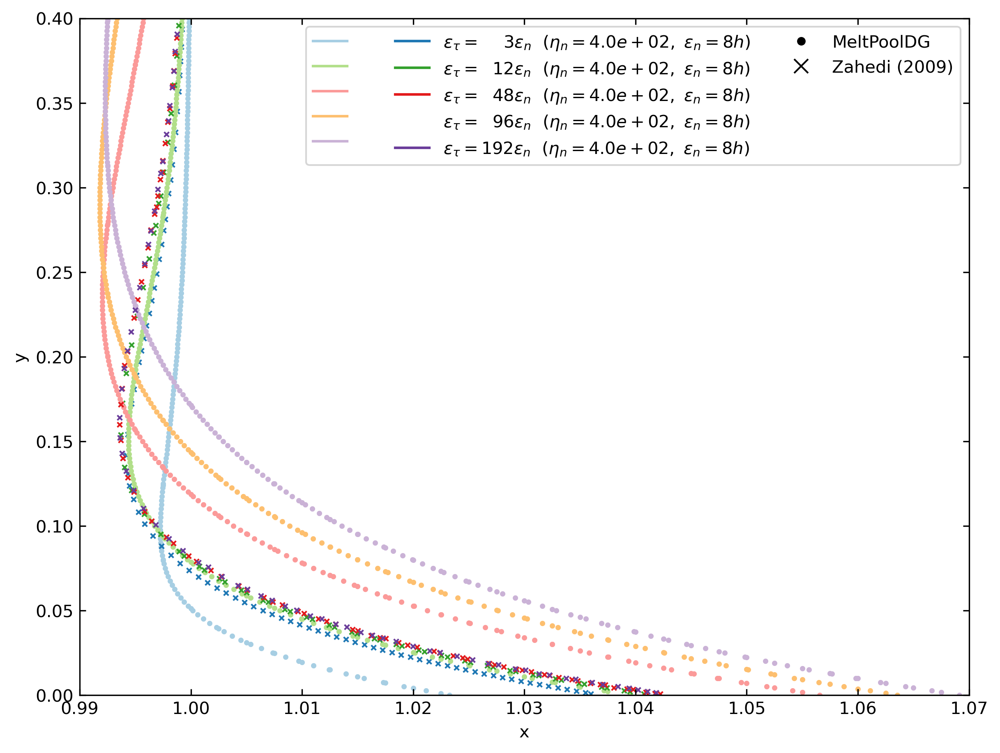
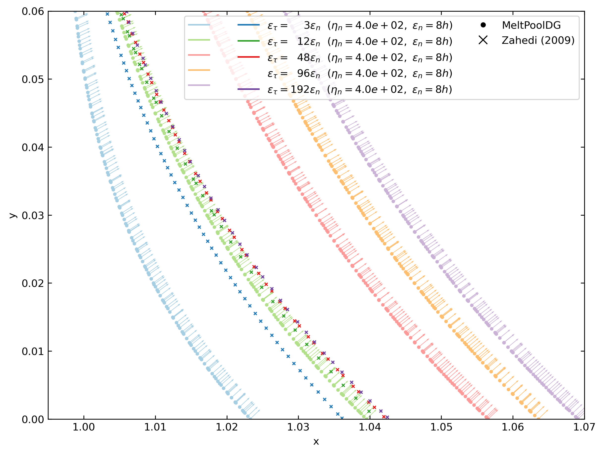
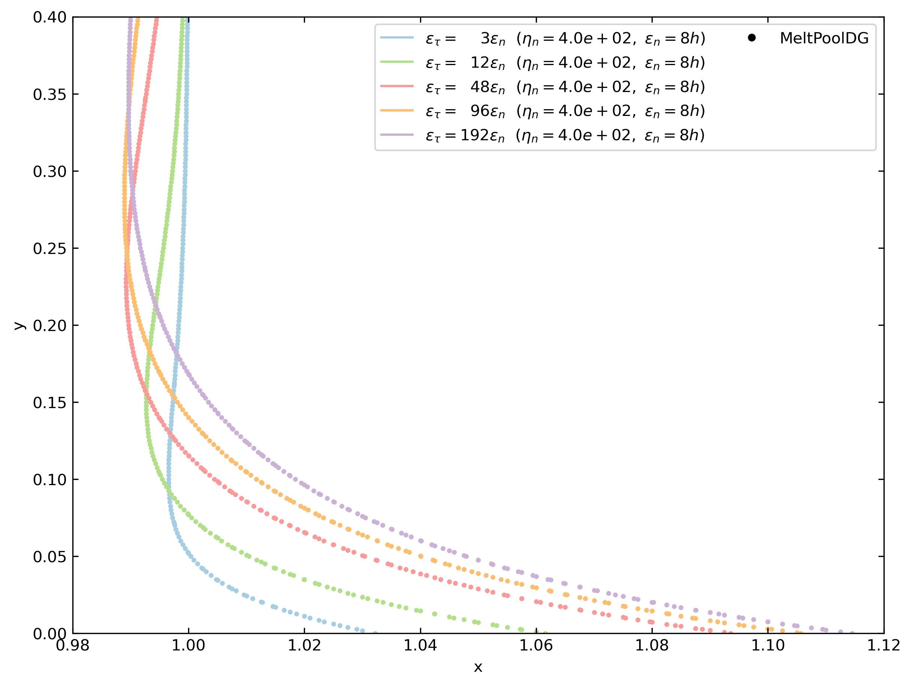
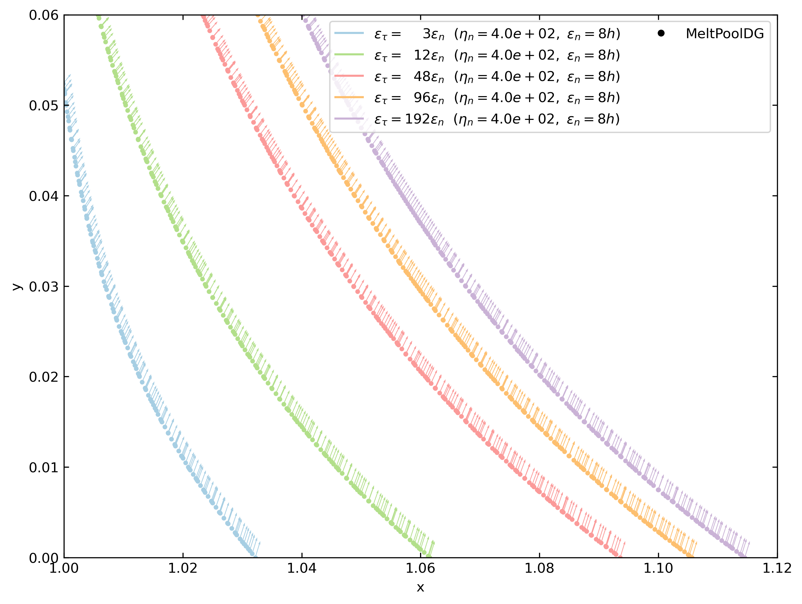
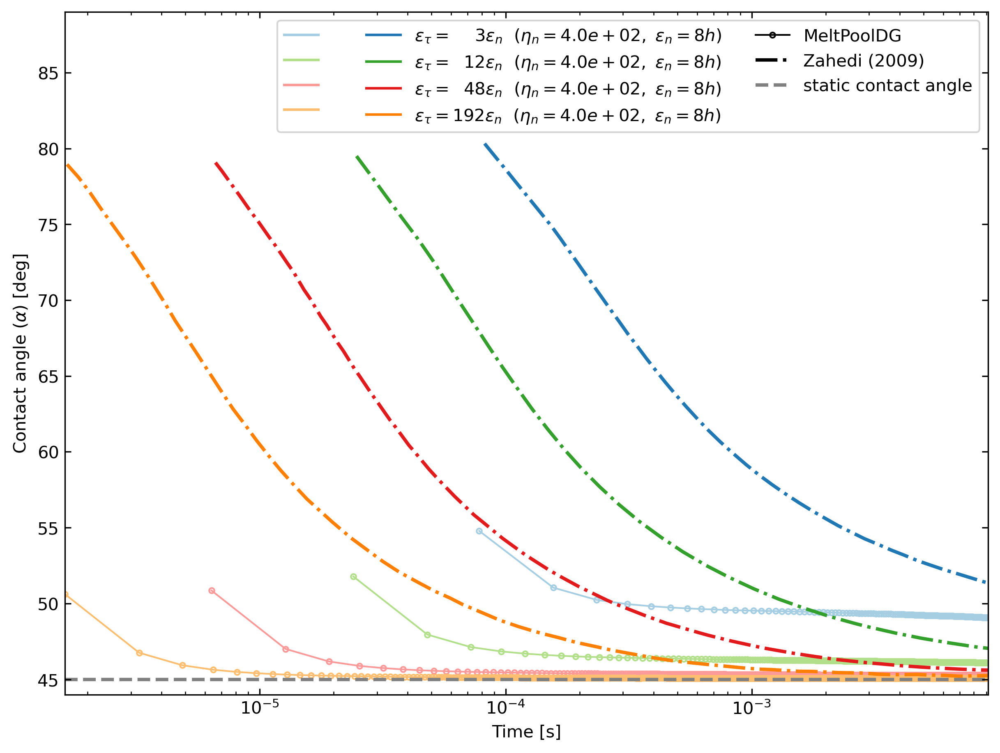
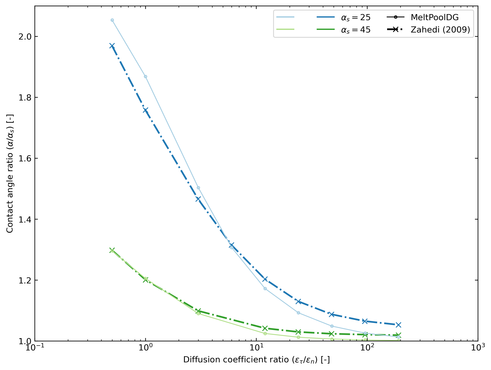

# Wall Wetting 

The cases discussed here simulate the ones studied in the *Model problem* section of *A conservative level set method for contact line dynamics* by Zahedi *et al.* (2009) [^1]

## Feature

- `mp-reinit` with wetting boundary condition

## Folder Structure and Files Used

Since many different cases are used for the study, a multiple folder structure is used. Here's a brief overview of the folder structure and important files.

All the files and folders described below are locate in the study folder `wall_wetting_zahedi_2009_comparison/`. 

1. Files: 
   - Bash script to generate cases: `generate_cases.sh`
   - Bash script to launch cases: `launch_cases.sh`
   - Bash script to post-process and generate all comparison figures: `post_process_cases.sh`
   - CSV file containing a list of cases and their parameters: `case_parameters.csv`
   - Template JSON parameter file: `zahedi_wall_wetting.tpl`


2. Folders:
   - Folder containing consol output logs: `logs/`
   - Folder containing simulation outputs: `outputs/`
   - Folder containing generated parameter files: `parameter_files/`
   - Folder with python post-processing scripts: `post_processing/`:
     - Contains also the folder with results from Zahedi *et al.* [^1]\: `post_processing/zahedi_results_csv_files/`
   - Folder where figures generated from post-processing are stored: `results_figures/` 

## Problem Description

The initial configuration of the problem is given by the figure 1.

<figure align="center">
  
</figure> 

**Figure 1**. Initial state of the problem. 

In a 2D domain $\Omega = [0,2] \times [0,2]$, we initiate the initial level set field $\phi(\vec{x})$ with:

$$\phi(x) = -\tanh\left(\frac{d(x)}{2\varepsilon} \right)$$

where
- $d(x) = x_\text{interface} - x$ is the signed distance from the interface 
- $\varepsilon = f_\varepsilon h$ is the interface thickness parameter with $f_\varepsilon$ a user-inputted constant factor and $h$ the cell-size. For all cases, $h$ is fixed to $0.005$ unless mentioned otherwise. 

We set the interface to be a vertical line at $x=0 \,(\Rightarrow x_\text{interface} = 0)$.

The reinitialization equation takes the following form:

$$ \frac{\partial\phi}{\partial \tau} + \nabla \cdot \left[\phi (1 - \phi) \vec{n}\right] - \nabla \cdot \left[\varepsilon_\text{n} (\nabla \phi \cdot \vec{n} ) \vec{n} \right] - \nabla \cdot \left[\varepsilon_\text{t} (\nabla \phi \cdot \vec{t} ) \vec{t} \right] = 0$$

where
- $\tau$ is the independent time variable
- $\vec{n}$ is the unit normal vector to the interface pointing in the direction $\nabla \phi$. Note that $\vec{n}$ is only computed once before starting the reinitialization process and the same vector $\vec{n}$ is used when solving the transient problem
- $\varepsilon_\text{n}$ is the diffusion coefficient in the normal direction to the interface. For all simulation cases, this parameter is set as $\varepsilon_\text{n} = \varepsilon$
- $\varepsilon_\text{t}$ is the diffusion coefficient in the tangential direction to the interface
- $\vec{t}$ is the unit tangential vector to the interface pointing in the direction orthogonal to $\vec{n}$

As defined in [^1], the time-step is given by $\Delta \tau = \frac{h^2}{2(\varepsilon_\text{n} + \varepsilon_\text{t})}$

To ensure continuity of the solution, $\vec{n}$ is filtered and computed by solving the following linear equation:

$$ \vec{n} - \nabla \cdot (\eta_\text{n} h^2 \nabla \vec{n}) = \frac{\nabla \phi}{\lVert \nabla \phi\rVert} $$

where $\eta_\text{n} = (f_\gamma f_\varepsilon)^2$ is the filtering factor with $f_\gamma$ the factor used in [^1] to do parametric sweep on the regularization parameter $(\gamma = f_\gamma \varepsilon_\text{n})$ they define.

In order to impose a given contact angle at the bottom wall, an interface normal vector Dirichlet boundary condition is imposed at the wall.

As we are interested in the bottom wall, for a given static contact angle $(\alpha_s)$, at bottom wall, we have:

$n_x|_{y=0} = \sin(\alpha_s)$

$n_y|_{y=0} = \cos(\alpha_s)$

## Generating the cases

Two different studies are conducted here in an aim to compare the implementation with the one of Zahedi *et al.* (2009) [^1]. The studies go as follows:

1. **Study 1: The influence of $\eta_\text{n}$ on the contact angle.**

   While fixing $\alpha_s = 45^\circ$, $\varepsilon_\text{n} = 8h$ and $\varepsilon_\text{t} = 6\varepsilon_\text{n}$ a parametric sweep is conducted on $\eta_\text{n}$ with $f_\gamma \in \{1.0, 2.5, 5.0, 10.0\}$. 

2. **Study 2: The influence of the ratio $\frac{\varepsilon_\text{t}}{\varepsilon_\text{n}}$ on the contact angle.**
   1. First, we set $\alpha_s = 45^\circ$, $\varepsilon_\text{n} = 8h$ and $f_\gamma = 2.5$. We then run a parametric sweep for $\frac{\varepsilon_\text{t}}{\varepsilon_\text{n}} \in \{0.5, 1, 3, 12, 24, 48, 96, 192\}$.
   2. Second, keeping the same $\varepsilon_\text{n}$ and $f_\gamma$, we set $\alpha_s = 25^\circ$ and run a parametric sweep for $\frac{\varepsilon_\text{t}}{\varepsilon_\text{n}} \in \{0.5, 1, 3, 6, 12, 24, 48, 96, 192\}$.

In both studies, we set the simulation end time ($\tau_\text{end}$) in such way that we can compare our results with the ones of Zahedi *et al.* [^1]. In other words, for the first study, we set $\tau_\text{end} = 0.05$ and for the second, $\tau_\text{end} = 0.01$.

Cases are generated in using the `generate_cases.sh` bash script with the CSV case parameter file (`case_parameters.csv`) and the template parameter file (`zahedi_wall_wetting.tpl`). 

The CSV case parameter file takes the following form:
```csv
case_name,static_contact_angle,epsilon_n_factor,epsilon_t_factor,gamma_factor,end_time
zahedi_wall_wetting_000,45,8,6,1,0.05
zahedi_wall_wetting_001,45,8,6,2.5,0.05
zahedi_wall_wetting_002,45,8,6,5,0.05
...
```

Note that the `case_name` contains the padded case number, i.e. "zahedi_wall_wetting_000" is associated with case #0 and "zahedi_wall_wetting_001" with case #1, and so on.

Cases 0 to 3 correspond to the first study, and cases 4 to 20 correspond to the second study.

One can generate the different cases JSON files by simply running the following command:

```bash
./generate_cases.sh
```

this will generate JSON files in a folder `parameter_files/` for all cases ranging from #0 to #20.

You can specify a different range of cases using the `-c` argument. 
For example, running 

```bash
./generate_cases.sh -c "0-3, 20"
```

will generate JSON files for cases number 0, 1, 2, 3, and 20.
For more information on the different arguments that be passed on, run:

```bash
./generate_cases.sh --help
```

## Running the cases

Calling the `launch_cases.sh` script, as shown bellow, runs by default simulations for cases 0 to 20 on 20 processes.

```bash
./launch_cases.sh
```

Similar to `generate_cases.sh`, one can specify which cases to run using the `-c` argument. 
The number of processes can also be changed using the `-np` argument. 
For more information on the other arguments, use `-h` or `--help`.

When `launch_cases.sh` is called, it:
   - runs the specified cases; 
   - logs the console (terminal) outputs in the `logs/` folder;
   - stores simulation outputs such as VTU files and contact angle evolution files (`wall_wetting.txt`) in subfolders for each case, and;
   - creates a summary file named with following syntax `contact_angles_summary_${timestamp}.csv` (e.g. `contact_angles_summary_20250530_144304.csv`); the file contains among other things the `computed_contact_angle` evaluated at $\tau_\text{end}$ of the simulations ran with the script.

## Post-processing and Results

### Post-processing Simulation Results

In the `post_processing/` folder, one can initially find the following:

- `zahedi_results_csv_files/`: contains results extracted from the figures 2-6 of Zahedi *et al.* [^1]. The data is stored in CSV format in subfolders for each figure.
- Post-processing python scripts that generate comparison figures:
  - `compare_figure_2.py`: Generates the comparison figure of the final time-step interface contours for different $\eta_\text{n}$ values.
  - `compare_figure_3.py`: Generates the comparison figure with the time evolution of the contact angle for different $\eta_\text{n}$ values.
  - `compare_figure_4.py`: Generates the comparison figure with the time evolution of the contact angle for different $\varepsilon_\text{tau}$ values.
  - `compare_figure_5a.py`: Generates the comparison figure of the final time-step interface contours for different $\varepsilon_\text{tau}$ values.
  - `compare_figure_5b.py`: Generates a close up of figure 5a near the contact point region.
  - `compare_figure_6.py`: Generates the comparison figure of the contact angle ratio $(\frac{\alpha}{\alpha_\text{s}})$ as a function of the diffusion coefficient ratio $(\frac{\varepsilon_\text{t}}{\varepsilon_\text{n}})$.

From the case's folder (`wall_wetting_zahedi_2009_comparison`) the `post_process_cases.sh` script can be run to generate all figures automatically using:

```bash
./post_process_cases.sh -r <path_to_file_with_simulation_results_summary>
```

Calling this script also by default generates a `comparison_figures/` folder in the `post_processing/` directory where all figures will be saved. To change this, one may pass a different argument with the `-ff` or `--figures_folder` flags.
For more information on the other arguments, use `-h` or `--help`.

### Simulation Results

#### Study 1

Figure 2 displays the comparison between the interface shape for the different $\eta_\text{n}$ values. As also observed by Zahedi *et al.* [^1], an increasing filtering factor leads to a larger region affected by the contact point. Conversely, using smaller $\eta_\text{n}$ leads to a smaller region affected by the contact point, but larger curvature variations are observed near the contact point. As mentioned in [^1], this indicates that the mesh will have to be fine enough to correctly capture the curvature.

<figure align="center">
  
</figure> 

**Figure 2**. Comparison of the isocontour at $\tau_\text{end}$ of the interface $(\phi=0)$ for different values of $\eta_\text{n}$. Here, $\alpha_\text{s} = 45^\circ$, $\varepsilon_\text{n} = 8h$,and $\varepsilon_\text{t} = 6 \varepsilon_\text{n}$.

In figure 3, a close up of figure 2 near the contact point region is shown. It can be observed that for the higher values of $\eta_\text{n}$ the unit normal vectors, indicated by the arrows, transition more gradually, which results in the larger transition region mentioned earlier. 

<figure align="center">
  
</figure> 

**Figure 3**. Close up near the contact point of the comparison of the isocontour at $\tau_\text{end}$ of the interface $(\phi=0)$ for different values of $\eta_\text{n}$. Here, $\alpha_\text{s} = 45^\circ$, $\varepsilon_\text{n} = 8h$,and $\varepsilon_\text{t} = 6 \varepsilon_\text{n}$. The arrows represent unit normal vectors to the interface.

Figure 4 shows the comparison of time evolution of the computed contact angle. For all simulations, with time, the contact angle tends to decrease towards $\alpha_\text{s} = 45^\circ$. However, MeltPoolDG's solutions converge a lot more quickly and results are slightly more precise, asymptotically. Table 1 contains the results of the final contact angle values. Note also, that in figure 4, some curves from MeltPoolDG's simulations have not "plateaued" yet.

<figure align="center">
  
</figure> 

**Figure 4**. Comparison of the time evolution of the contact angle for different $\eta_\text{n}$. Here, $\alpha_\text{s} = 45^\circ$, $\varepsilon_\text{n} = 8h$, and $\varepsilon_\text{t} = 6 \varepsilon_\text{n}$.

**Table 1**: Comparison of the final contact angle for different $\eta_\text{n}$ values with $\alpha_\text{s} = 45^\circ$, $\varepsilon_\text{n} = 8h$, and $\varepsilon_\text{t} = 6 \varepsilon_\text{n}$. 

| $\eta_\text{n}$ | $f_\gamma$ | $\alpha_\text{Zahedi}$ $[^\circ]$ | $\alpha_\text{MeltPoolDG}$ $[^\circ]$ |
|-----------------|------------|-----------------------------------|---------------------------------------|
| 64              | 1          | 50                                | 47                                    |
| 400             | 2.5        | 49                                | 47                                    |
| 1600            | 5          | 48                                | 47                                    |
| 6400            | 10         | 46                                | 46                                    |


### Study 2

Figure 5 compares the interface position at the end of the simulations for different values of $\varepsilon_\text{t}$ such that $\frac{\varepsilon_\text{t}}{\varepsilon_\text{n}} \in \{3, 12, 48, 96, 192\}$ when $\alpha_\text{s} = 45^\circ$. Note that the curve $\frac{\varepsilon_\text{t}}{\varepsilon_\text{n}} = 96$ was added here even though [^1] don't report the results. Except when $\varepsilon_\text{t} = 12 \varepsilon_\text{n}$, the interface resulting from MeltPoolDG's simulations are observably different. A reason for this has not been found yet. As observed by Zahedi *et al.* [^1], for the larger values of $\varepsilon_\text{t}$ the interface does seem to converge in the region away from the contact point. However, near the contact point, as seen in figure 6, there seems to be a persisting gap with increasing $\varepsilon_\text{t}$.  

<figure align="center">
  
</figure> 

**Figure 5**. Comparison of the isocontour at $\tau_\text{end}$ of the interface $(\phi=0)$ for different values of $\varepsilon_\text{t}$. Here, $\alpha_\text{s} = 45^\circ$, $\varepsilon_\text{n} = 8h$, and $\eta_\text{n} = 400$.

<figure align="center">
  
</figure> 

**Figure 6**. Close up near the contact point of the comparison of the isocontour at $\tau_\text{end}$ of the interface $(\phi=0)$ for different values of $\varepsilon_\text{t}$. Here, $\alpha_\text{s} = 45^\circ$, $\varepsilon_\text{n} = 8h$, and $\eta_\text{n} = 400$. The arrows represent unit normal vectors to the interface.


Figures 7 and 8, analogous to figures 5 and 6, show the interface position for different values of $\varepsilon_\text{t}$ when $\alpha_\text{s} = 25^\circ$. Similar tendencies are observed here, indicating that the difference observed with the results of Zahedi *et al.* [^1] is not related to the imposed static angle, but probably the formulation of the reinitialization equation itself. A sensitivity analysis on the time-step values was also conducted. However, results showed that changing the time-step size did not significantly impact the final result.

<figure align="center">
  
</figure> 

**Figure 7**. Comparison of the isocontour at $\tau_\text{end}$ of the interface $(\phi=0)$ for different values of $\varepsilon_\text{t}$. Here, $\alpha_\text{s} = 25^\circ$, $\varepsilon_\text{n} = 8h$, and $\eta_\text{n} = 400$.

<figure align="center">
  
</figure> 

**Figure 8**. Close up near the contact point of the comparison of the isocontour at $\tau_\text{end}$ of the interface $(\phi=0)$ for different values of $\varepsilon_\text{t}$. Here, $\alpha_\text{s} = 25^\circ$, $\varepsilon_\text{n} = 8h$, and $\eta_\text{n} = 400$. The arrows represent unit normal vectors to the interface.


Figure 9 shows the computed contact angle evolution for different values of $\varepsilon_\text{t}$ when $\alpha_\text{s} = 45^\circ$. As observed in the first study, MeltPoolDG converges to its final contact angle value at a higher rate, and again, results are more precise than the ones of Zahedi *et el.* [^1]. However, in figure 10, it can be observed that for lower $\frac{\varepsilon_\text{t}}{\varepsilon_\text{n}}$ values and $\alpha_\text{s} = 25^\circ$ the results of [^1] are in fact better.

<figure align="center">
  
</figure> 

**Figure 9**. Comparison of the time evolution of the contact angle for different $\varepsilon_\text{t}$. Here, $\alpha_\text{s} = 45^\circ$, $\varepsilon_\text{n} = 8h$, and $\eta_\text{n} = 2.5$.

<figure align="center">
  
</figure> 

**Figure 10**. Comparison of the contact angle ratio $(\frac{\alpha}{\alpha_\text{s}})$ in function of the diffusion coefficient ratio $(\frac{\varepsilon_\text{t}}{\varepsilon_\text{n}})$ for $\alpha_\text{s} \in \{ 25, 45\}$ with $\varepsilon_\text{n} = 8h$, and $\eta_\text{n} = 400$.

## References

[^1]: S. Zahedi, K. Gustavsson, and G. Kreiss, “A conservative level set method for contact line dynamics,” *J. Comput. Phys.*, vol. 228, no. 17, pp. 6361–6375, Sep. 2009, doi: 10.1016/j.jcp.2009.05.043.
